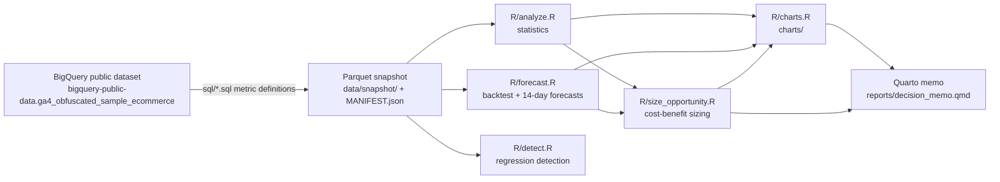

# ProductMetricsReview

A full product-analytics cycle on the Google Merchandise Store GA4 public sample
(2020-11-01 to 2021-01-31): metric definitions in BigQuery SQL, statistics and forecasting
in R, regression detection, cost-benefit sizing, and a decision memo for a PM.

**The short version.** We asked three questions: does mobile convert worse than desktop,
where does the funnel leak, and did the holiday peak move value or volume? Mobile converts
slightly *higher* than desktop and the gap vanishes once returning-user status, country and
week are controlled for (odds ratio 1.06 [1.00, 1.12]). The funnel leaks hardest at
view item → add to cart (19.7% conversion, 61,853 sessions lost in 92 days, no device
difference). The holiday moved *volume* (+62.7% purchases per day) while average order value
*fell* $12.66 [−$20.05, −$5.32]. The decision: do **not** build a funnel-step fix yet — at an
assumed 10% lift it nets only +$6,076 in year one (ROI 9.8%) against a 9.1% break-even lift,
so the recommendation is a cheap A/B experiment on the lift first.
[Full decision memo](reports/decision_memo.md) · [HTML version](reports/decision_memo.html).

## Results at a glance

| Question | Result | File |
|----------|--------|------|
| Mobile vs desktop conversion | mobile 1.39% vs desktop 1.32% (raw gap +0.08 pp); adjusted odds ratio 1.06 [1.00, 1.12] — the gap does not survive controls | `output/q1_device_rates.csv`, `output/q1_logistic_or.csv` |
| Worst funnel step | view item → add to cart: 19.7% [19.4, 20.0] conversion, 61,853 sessions lost; conversion does not differ by device (χ² = 1.9, p = 0.39) | `output/q2_worst_step_test.csv` |
| Holiday: value vs volume | purchases/day +62.7%; AOV −$12.66 [−$20.05, −$5.32] — a volume holiday, not a value one | `output/q3_holiday_value_volume.csv` |
| Forecast winners (backtest RMSE) | dau: ETS 546 vs SNAIVE 723 · purchase sessions: ETS 26.0 vs 30.3 · revenue: ARIMA+holiday 2,264 vs 2,488 | `output/backtest.csv`, `output/forecast_winners.csv` |
| Regressions flagged (last 14 days) | none (rule: 2+ days below lo95, or 5 of 7 below lo80) | `output/regressions.csv` |
| Sizing the funnel fix | net benefit +$6,076 year 1 · ROI 9.8% · payback 10.7 months · break-even lift 9.1% | `output/opportunity_sizing.csv` |


## Pipeline



## Quickstart

```sh
Rscript -e 'renv::restore()'   # install the pinned package stack (renv.lock)
make all                       # analyze, forecast, detect, report (charts + memo), test
```

`make all` runs entirely from the committed Parquet snapshot — no BigQuery credentials.
`make extract` refreshes the snapshot from BigQuery and needs only a billing project:

```sh
export GCP_PROJECT_ID=<your-billing-project>
make extract
git add data/snapshot && git commit -m "snapshot: refresh GA4 aggregated tables"
```

Raw event-level rows are never committed: `R/extract.R` refuses to write tables that exceed
daily-grain row/date limits.

## Methodology

- **Ordered session funnel** (`sql/11_funnel_daily.sql`): a session counts at a step only if
  it reached every earlier step, with the earlier event timestamp at or before the later one
  (greedy earliest-completion matching). Independent step counts would credit sessions that
  viewed an item *after* checking out and inflate later-stage conversion.
- **Rolling-origin cross-validation** (`R/forecast.R`): minimum 42-day training window,
  7-day horizon, origins advancing 7 days. Every forecast is scored against data the model
  never saw, so model selection cannot overfit the tail of the series.
- **Seasonal naive baseline**: SNAIVE (last week's same day) is the "am I better off with no
  model" benchmark — a model only wins if it beats SNAIVE on backtest RMSE.
- **Intervals, not point forecasts**: the memo shows 80%/95% prediction intervals; a point
  number would overstate the certainty of a 14-day daily forecast from 92 days of data. The
  regression detector consumes the lower bounds (2+ days below lo95, or 5 of 7 trailing days
  below lo80; a single-day dip never fires).
- **Holiday handling**: Black Friday–Christmas is a level shift, not weekly seasonality.
  ARIMA gets an explicit holiday dummy regressor; ETS/SNAIVE absorb it via adaptivity. See
  the comment block in `R/forecast.R`.

## Limitations

- **Observational data**: one store, 92 days, no counterfactuals — associations, not causal
  effects.
- **Obfuscated sample**: Google replaces some values with placeholders (e.g. `<Other>`);
  zero-revenue purchases are obfuscated NULLs and are excluded from AOV explicitly, never
  dropped silently.
- **Assumed lift**: the sizing's 10% point lift is an assumption, not a measured effect; the
  break-even lift and tornado chart make that explicit.
- **Holiday inside the window**: backtest scores and AOV span Black Friday through Christmas;
  the detection holdout is the post-holiday tail.
- **Right-censored cohorts**: late retention cohorts have unobserved weeks (omitted, not
  reported as zero).

## Tech stack

R 4.x (`bigrquery`, `fable`, `forecast`, `broom`, `boot`, `ggplot2`, `testthat`; snapshots via
`arrow`/Parquet) · BigQuery Standard SQL · Quarto · GitHub Actions CI.

## Data

- Source: `bigquery-public-data.ga4_obfuscated_sample_ecommerce.events_*`
- Range: 2020-11-01 to 2021-01-31
- Snapshot: aggregated daily-grain tables committed as Parquet in `data/snapshot/`, described
  by `data/snapshot/MANIFEST.json`.

## Repo layout

```
sql/            BigQuery Standard SQL metric definitions (one table per file)
R/              R scripts (extract, analyze, forecast, detect, size_opportunity, charts)
config/         Sizing assumptions (measured vs assumed, low/point/high)
data/snapshot/  Committed Parquet snapshots + MANIFEST.json (analysis input, no creds needed)
output/         Generated CSV artifacts (committed); output/tmp/ is ignored
charts/         PNG charts for the memo (committed)
reports/        Quarto decision memo (qmd source, rendered gfm + html)
tests/          testthat tests
.github/        GitHub Actions CI (runs make all from the snapshot)
```

## Metric definitions (`sql/`, one table per file)

| File | Table | Grain |
|------|-------|-------|
| `10_daily_active.sql` | `daily_active(event_date, dau, sessions, new_users)` | day |
| `11_funnel_daily.sql` | `funnel_daily(event_date, device_category, sessions, view_item_sessions, add_to_cart_sessions, begin_checkout_sessions, purchase_sessions)` | day × device |
| `12_retention_cohorts.sql` | `retention_cohorts(cohort_week, weeks_since_first_visit, cohort_size, retained_users)` | cohort week × week |
| `13_revenue_daily.sql` | `revenue_daily(event_date, device_category, purchases, revenue_usd)` | day × device |
| `14_session_outcomes.sql` | `session_outcomes(event_date, device_category, country, is_returning_user, purchased, revenue_usd)` | session |

Sessions are `user_pseudo_id` + `ga_session_id` (UNNESTed from `event_params`); all queries
bound the window with `_TABLE_SUFFIX BETWEEN '20201101' AND '20210131'`. All metric logic
lives in `sql/`; R only reads the committed snapshot tables.

## Workflow

| Target           | What it does                                  | Needs BigQuery creds |
|------------------|-----------------------------------------------|----------------------|
| `make extract`   | Run `sql/*.sql`, snapshot Parquet + MANIFEST  | yes (`GCP_PROJECT_ID`) |
| `make analyze`   | Statistics from the committed snapshot        | no |
| `make forecast`  | Backtest + 14-day forecasts                   | no |
| `make detect`    | Regression detection on the last 14 days      | no |
| `make report`    | Sizing + charts + Quarto memo                 | no |
| `make test`      | testthat suite                                | no |
| `make all`       | analyze + forecast + detect + report + test   | no |

## License

MIT — see [LICENSE](LICENSE).
