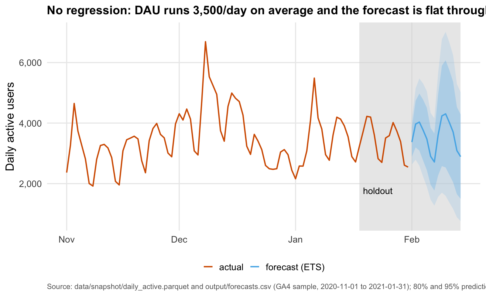
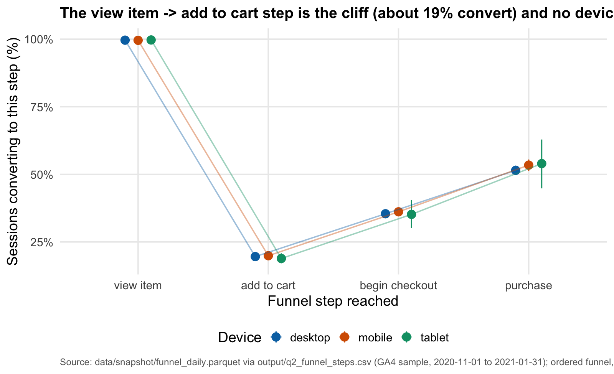
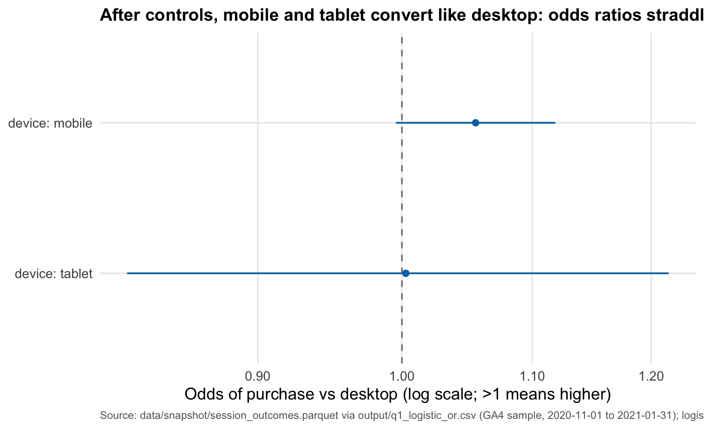
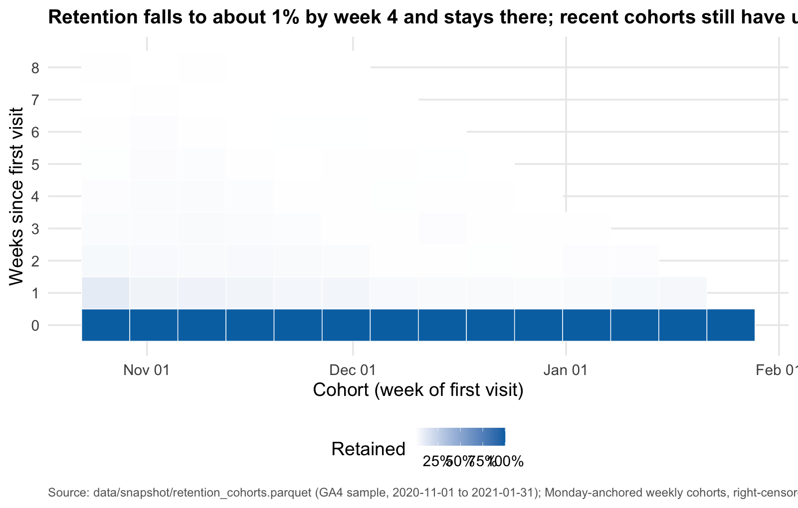
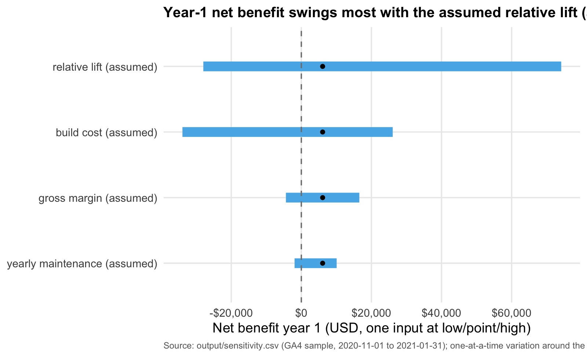

# Fix the view→cart step

# Recommendation

**Don’t build it yet.** At the assumed 10.0% lift, fixing the view→cart
step earns only \$6,076.17 in year one — barely above break-even (the
minimum lift that pays for itself is 9.1%). Run a cheap A/B experiment
to prove the lift first; build only if it clears 9.1%.

# Why

- **The step is the biggest leak:** view→cart drops 61,853 sessions in
  92 days — the single largest absolute funnel loss, at a 19.7%
  conversion.
- **But the prize is small:** even a 10.0% lift yields only 1,124
  incremental purchases (~\$104,733 revenue, \$68,076.17 gross profit)
  per year against a \$50,000 build plus \$12,000/year upkeep.
- **The answer hinges on one assumption:** the assumed lift swings
  year-1 net benefit by ~102k USD in sensitivity, while build cost
  swings it by only 60k — so an experiment that measures the lift is the
  highest-value next step.

# What the data shows

# Cost and return

| Item                                | Value       |
|:------------------------------------|:------------|
| View→cart step conversion today     | 19.7%       |
| Sessions lost at the step (92 days) | 61,853      |
| Addressable sessions per year       | 305,568     |
| Cart→purchase conversion            | 18.7%       |
| Assumed relative lift on the step   | 10.0%       |
| Average order value (pre-holiday)   | \$93.15     |
| Incremental purchases per year      | 1,124       |
| Incremental revenue per year        | \$104,733   |
| Incremental gross profit per year   | \$68,076.17 |
| Build cost (one-time)               | \$50,000    |
| Yearly maintenance                  | \$12,000    |
| Net benefit, year 1                 | \$6,076.17  |
| ROI, year 1                         | 9.8%        |
| Payback                             | 10.7 months |
| Break-even lift                     | 9.1%        |

The project breaks even at a 9.1% lift on the step. Below that, net
benefit is negative.

# What would change my mind

- A **measured lift** (from an A/B test) at or above 9.1% — that
  converts this from a bet on an assumption into a positive-ROI build.
- Evidence that the **cart→purchase downstream** (18.7% today) improves
  with a better cart experience, multiplying the value of the fix.
- The **device parity result changing**: the funnel is uniform across
  devices now; a device-specific cliff would change the target and the
  sizing.
- A **bigger lift upside** — if the assumed high case (20.0%) is
  credible, the swing analysis shows the payoff re-rates the whole
  decision.

# Method + limitations

- **Observational data:** the GA4 public sample is one ecommerce store
  over 92 days; effects are correlations, not causal evidence. All
  figures come from `output/` CSVs and the committed snapshot.
- **Obfuscated sample:** Google replaces some values with placeholders
  (e.g. `<Other>`); zero-revenue purchases are obfuscated NULLs and were
  excluded from AOV, not dropped silently.
- **Holiday window:** Black Friday through Christmas sits inside the
  sample; sizing uses the pre-holiday AOV as business-as-usual and
  annualizes the 92-day funnel.
- **Assumed lift:** the 10.0% point lift is an assumption, not a
  measured effect; the tornado chart and break-even lift make that
  explicit.
